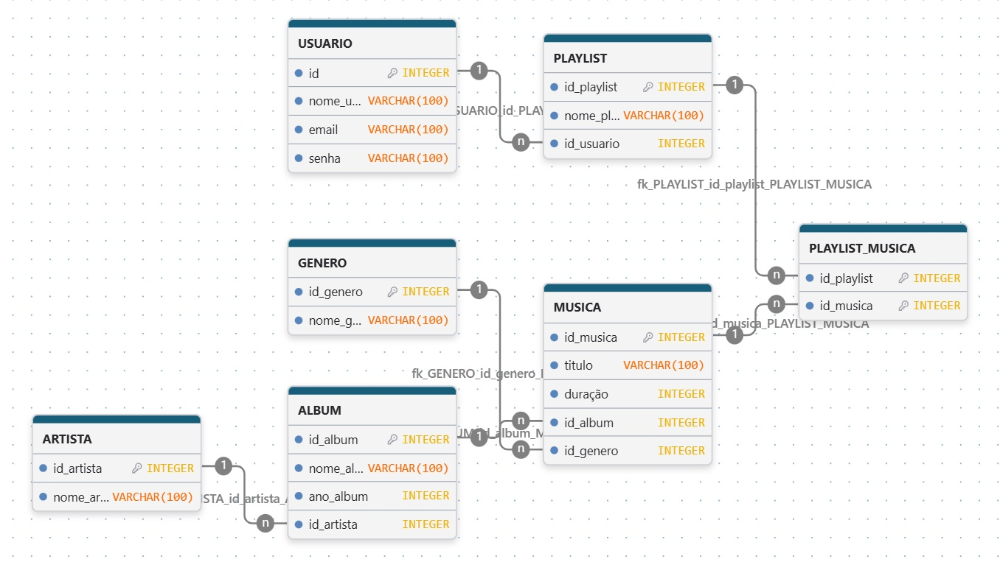

# Catálogo de Música

Projeto desenvolvido para a disciplina de programação.

## Sobre o projeto

O Catálogo de Música é um sistema desenvolvido em Python para cadastrar e organizar músicas e playlists.

O sistema permite cadastrar músicas, pesquisar, editar e excluir músicas, além de criar playlists e adicionar músicas a elas.

## Funcionalidades

- Cadastrar músicas
- Listar músicas
- Buscar músicas
- Editar músicas
- Excluir músicas
- Criar playlists
- Listar playlists
- Adicionar músicas às playlists

## Tecnologias utilizadas

- Python
- SQLite
- PostgreSQL
- GitHub
- Drawdb

## Estrutura do projeto

- `main.py` → arquivo principal do sistema
- `funcoes.py` → funções utilizadas pelo sistema
- `dados.py` → dados iniciais das músicas
- `banco.db` → banco de dados SQLite
- `README.md` → documentação do projeto

## Integrantes

- Manoel
- Eduardo
- Felipe

